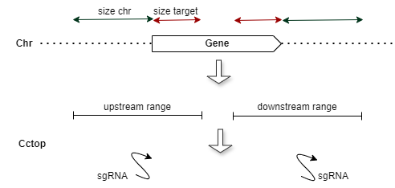

# batch_sgRNA

Pipeline to predict sgRNAs in batch from a BED file.
This pipeline was created with the purpose of predicting sgRNAs to assess the presence of a large number of predicted ncRNAs. The concept of prediction was based in the web-based Eukaryotic Pathogen CRISPR guide RNA/DNA Design Tool, which predict sgRNA from the ends of the genes. Our current predictions use the CCTop, tool available, which incorporates an efficiency parameter that considers the number of potential off-targets.



## Pipeline batch_sgRNA.sh Overview:
Reads the input BED file.
Generates a new BED file with extended coordinates from target gene.
Extracts FASTA sequences using a default extension of 150 bp  by default.
Indexes the reference FASTA genome.
Predicts sgRNAs for each target sequence in both the 5′ upstream and 3′ downstream regions of the gene.
posprocessing_outcctop.py: Compiles a table with the top 3 sgRNAs predicted by CCTop for each target gene.

## Optional parameters
- dist_chr = 100 (default).
- dist_target = 0 (default). This value can be adjusted if necessary: use 50 when the knockout should in some cases occur within the target gene; use 0 if the knockout does not need to fall inside the gene.
- targetprimer: work name

## Mandatory Tools: 
cctop 
bowtie2
bedtools

## Mandatory Inputs: 
- genome reference 
- BED format file

<pre> LbrM2903_01 10500 10600 LbrM2903_01_ncRNA1 . + </pre>
<pre> LbrM2903_01 10700 10800 LbrM2903_01_ncRNA2 . + </pre>

## Invoking batch_sgRNA:
```
bash /path/to/batch_sgRNA/batch_sgrna.sh -bedfile /path/to/batch_sgRNA/test/file.bed -reffasta /path/to/batch_sgRNA/test/referencegenome.fasta -dist_chr 100 -dist_target 0 -outname targetprimer -refgff /path/to/batch_sgRNA/test/referencegenome.gff
bash /path/to/batch_sgRNA/batch_sgrna.sh -bedfile /path/to/batch_sgRNA/test/file.bed -reffasta /path/to/batch_sgRNA/test/referencegenome.fasta
```

## Test diretory
```
bash batch_sgrna.sh -bedfile /cctop_standalone/batch_sgRNA/test/ncrna_teste.bed -reffasta /cctop_standalone/batch_sgRNA/test/LBRAZ_M2903.Dec2022.fasta -dist_chr 100 -dist_target 0 -outname targetprimer -refgff /cctop_standalone/batch_sgRNA/test/LBRAZ_M2903.Dec2022_noncoding.gff
```
genome ref: LBRAZ_M2903.Dec2022.fasta
bed file: ncrna_teste.bed
optional gff ref: LBRAZ_M2903.Dec2022_noncoding.gff

## Outputs:
- outname_initial.bed: new coordenates of  5′ upstream regions of the gene
- outname_final.bed new coordenates of 3′ downstream regions of the gene
- outname_initial.fasta 
- outname_final.fasta
- output_cctop/*.xls
- output_cctop/*.bed
- output_cctop/*.fasta
- output_cctop/cctop_listtop.tsv

python3 posprocessing_outcctop.py

##  Parameters used for filters
- efficiency parameter >900 Candidates are scored from 1000 - suggested best choice to 0 - worst choice. This score takes into account the number of off-targets in the genome, their quality, i.e. number of mismatches and position with respect to the PAM, and the distance to gene exons. 
- efficiency_CRISPRater between 0 and 1

